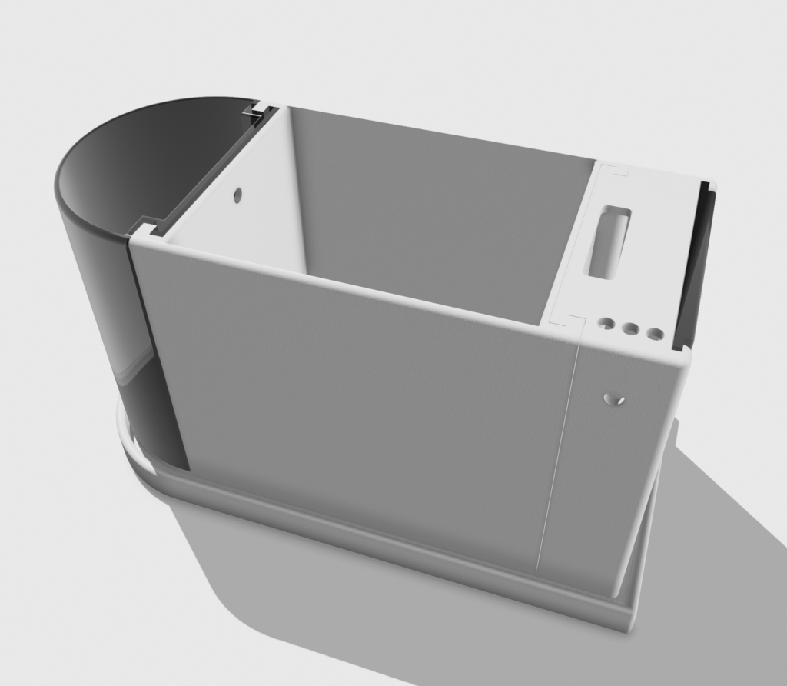

# 简易智能花盆的设计与实现

随着智能家居的普及，越来越多的设备变得智能化。作为园艺爱好者，如果能够拥有一个能够自动监测和反馈土壤湿度的智能花盆，无疑会大大提升养花的便利性和乐趣。本文将介绍如何利用3D打印技术和ESP8266 D1 Mini开发板，设计并实现一个简易智能花盆。

## 一、材料与工具

1. **硬件部分**：
   - ESP8266 D1 Mini 开发板
   - 土壤湿度传感器
   - 红色、绿色和蓝色LED灯各一只
   - 电阻和连接线
   - 面包板或PCB

2. **软件部分**：
   - Arduino IDE
   - 相关的库（如 `Ticker.h`）

3. **其他工具**：
   - 3D打印机
   - 3D打印材料（PLA或ABS）

## 二、3D 打印智能花盆模型

在设计智能花盆时，我们需要考虑传感器和电子元件的安装位置。可以使用3D建模软件（如Fusion 360或TinkerCAD）设计花盆的外壳。

1. **设计要点**：
   - 花盆的底部设计一个传感器插槽，确保土壤湿度传感器可以接触到土壤。
   - 花盆的侧面设计一个小凹槽，用于放置ESP8266 D1 Mini及其连接线。
   - LED灯可以安装在花盆的顶部或侧面，便于观察。
   - 在侧面或底部设计水箱利用虹吸效应自动补水

2. **打印模型**：
   - 使用3D打印机将设计好的模型打印出来。建议使用PLA材料，因为它环保且易于打印。



## 三、硬件连接

将土壤湿度传感器和LED灯连接到ESP8266 D1 Mini开发板上。

1. **连接图**：
   - 土壤湿度传感器的信号引脚连接到A0引脚
   - 红色LED连接到D1引脚
   - 绿色LED连接到D2引脚
   - 蓝色LED连接到D3引脚

2. **电路图**：

```
       [ESP8266 D1 Mini]
           |        | 
       [D1]---|---[RED LED]
           |        |
       [D2]---|---[GREEN LED]
           |        |
       [D3]---|---[BLUE LED]
           |        |
         [A0]---[土壤湿度传感器]
```

## 四、软件编程

使用Arduino IDE对ESP8266 D1 Mini进行编程，使其能够读取土壤湿度传感器的数据并控制LED灯的状态。以下是主要的代码实现：

```cpp
int ASignal = A0;

// LED pins
#define RED_LED_PIN D1
#define GREEN_LED_PIN D2
#define BLUE_LED_PIN D3

void setup() {    
  pinMode(ASignal, INPUT);       
  pinMode(RED_LED_PIN, OUTPUT);
  pinMode(GREEN_LED_PIN, OUTPUT);
  pinMode(BLUE_LED_PIN, OUTPUT);
  Serial.begin(9600);
}

void loop() {
  int sensorValue = analogRead(ASignal);
  
  // Convert the sensor value to a percentage (0 - 100%)
  float humidityPercent = 100 - ((sensorValue / 1023.0) * 100);

  // Print sensor value and humidity percentage to Serial
  Serial.print("Moisture: ");
  Serial.print(sensorValue);
  Serial.print(" | Humidity: ");
  Serial.print(humidityPercent, 1);
  Serial.println("%");

  // Control LED based on humidity level
  if (humidityPercent > 70) {
    digitalWrite(BLUE_LED_PIN, HIGH);
    digitalWrite(GREEN_LED_PIN, LOW);
    digitalWrite(RED_LED_PIN, LOW);
  } else if (humidityPercent >= 30 && humidityPercent <= 70) {
    digitalWrite(BLUE_LED_PIN, LOW);
    digitalWrite(GREEN_LED_PIN, HIGH);
    digitalWrite(RED_LED_PIN, LOW);
  } else {
    digitalWrite(BLUE_LED_PIN, LOW);
    digitalWrite(GREEN_LED_PIN, LOW);
    digitalWrite(RED_LED_PIN, HIGH);
  }

  delay(3000);
}
```

## 五、结果展示与改进

1. **测试与调试**：
   - 将组装好的智能花盆放置在花盆中，确保传感器能够接触到土壤。
   - 观察不同湿度下LED灯的变化，验证系统是否能准确反馈土壤湿度。

2. **改进方向**：
   - 增加WiFi功能，实现远程监控。
   - 使用更高精度的传感器，提高测量准确性。
   - 添加其他环境监测传感器，如温度和光照传感器。


## 六、结论

通过这次项目，我们成功设计并实现了一个简易智能花盆。它不仅可以实时监测土壤湿度，还能通过LED灯直观地反馈湿度状态。未来可以通过增加更多的功能，使其更加智能化，为家庭园艺带来更多的便利和乐趣。